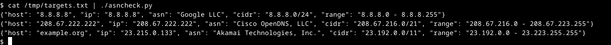

# asntools

Some simple utilities that use the [ipwhois](https://pypi.org/project/ipwhois/) module to look up ASN data associated with a target or targets. I wrote these scripts to help automate some OSINT and validation tasks, making it easier to check the provenance of a host or find associated hosts.



All tools in this repository produce output in JSONL format. Use tools like `jq` to parse the output programmatically. For example, to extract a list of unique ASNs associated with a target list:

```sh
$ cat targets.txt | asncheck | jq .asn | sort -u
```

## asncheck

Retrieves information about the ASN associated with one or more hostnames or IP addresses.

```sh
$ echo "8.8.8.8" | asncheck
$ cat targets.txt | asncheck
```

## asnexpand

Retrieves the AS number for one or more hostnames or IP addresses, then expands it into a list of CIDR ranges associated with that ASN.

```sh
$ echo "8.8.8.8" | asnexpand
$ cat targets.txt | asnexpand
```

## cidrexpand

A helper tool that expands the CIDR ranges from `asncheck` or `asnexpand` into a full list of IP addresses.

```sh
$ echo "8.8.8.8" | asncheck | jq -r .cidr | cidrexpand
```

## Subnet Enumeration

When you enumerate an ASN with `asncheck`, you might get a very large range such as a /16. If this ASN is owned by the organisation you want to target, this is great and your work can end here. 

Often, however, the ASN you get is owned by a hosting provider or ISP. In some cases, there are more specific subnets within this range that have their own ASN designations.

You can use the tools in this repository to enumerate an ASN by bruteforce, looking for subnets with their own designation:

```sh
$ echo "8.8.8.8" | ./asncheck.py | jq -r .cidr | ./cidrexpand.py | ./asncheck.py
```

Note that this can take a *long* time, especially for larger ranges.
